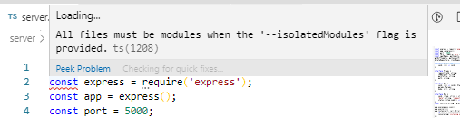

## Содержание
1. [Установка](https://github.com/d3f38/myArcanumWithReact/blob/master/README.md#установка)
2. [Запуск проекта](https://github.com/d3f38/myArcanumWithReact/blob/master/README.md#запуск)
3. [Тестирование](https://github.com/d3f38/myArcanumWithReact/blob/master/README.md#тестирование)
4. [Переход на TypeScript](https://github.com/d3f38/myArcanumWithReact/blob/master/README.md#переход-на-TypeScript)

## Установка

1. Склонировать репозиторий `https://github.com/d3f38/myArcanumWithReact.git`
2. Перейти в репозиторий и установить зависимости, прописав команду `npm install`

## Запуск

Для просмотра проекта необходимо:

1. Открыть терминал и запустить сервер командой   

#### `node .\server\server.js 'место до папки с репозиториями'`

2. Открыть второй терминал и ввести команду

#### `npm start`

После откроется новая вкладка по адресу [http://localhost:3001](http://localhost:3001) (не исправил отображение на 3000 порту, возможно придется согласится с открытием нового порта)

### Реализовано

- использование create-react-app;
- навигация без перезагрузки страницы и сменой URL;
- при клике по директориям показывается содержимое этих директорий;
- при клике на файлы показывается содержимое этих файлов;
- при обновлении или прямом заходе по этому URL мы попадаем в тот же файл/директорию;
- разделение CSS по-компонентно.

### Осталось реализовать

- переходы по 'хлебным крошкам';
- оптимизация запросов на сервер, т.к. большие репозитории долго грузятся;

## Тестирование

### Интеграционное тестирование

Для запуска тестов необходимо, чтобы обязательно была установлена Гермиона. В зависимости от того, какая у вас установлена операционная система установка Гермионы будет отличаться. Из основного, вам необходимо установить пакет `npm install hermione`. И далее, при возникновении проблем искать решение в интернете, так как все сталкиваются с разными проблемами при установке.

#### Запуск

Запустить 4 команды в разных терминалах:

1. Для запуска сервера:
`node .\server\server.js 'место до папки с репозиториями'` - выбрав свою папку с репозиториями и прописав новые данные в файле test.hermione.js согласно тестируемому репозиторию:   
`const repositoryName = 'Yandex'`   
`const pathToDirectory = 'css'`      
`const pathToFile = 'css/normalize.css'`  

либо воспользоваться тестовым репозиторием ничего больше не прописывать:) : 
    1)`git clone https://github.com/d3f38/Yandex.git ./testData/`
    2) `node .\server\server.js .\testData\Yandex`

2. Для запуска react:
 `npm start`
3. Для запуска selenium:
`selenium-standalone start`
4. Для запуска Hermione:
`node_modules/.bin/hermione`

После этого откроется новое окно браузера и начнут выполняться тесты.

### Пример результата выполнения тестов:

### Модульное тестирование

#### Запуск

Запустить команду `npm test`

#### Тестируемые блоки

1. Список репозиториев   
    √ Проверка на то, что при запросе списка репозиториев на выходе мы получаем массив   
    √ Проверка на то, что при запросе списка репозиториев в массиве приходят репозитории как в заглушке   
2. Содержимое репозиториев   
    √ Проверка на то, что при запросе приходит содержимое репозитория как в заглушке   
3. Содержимое файла   
    √ Проверка на то, что при запросе файла приходит содержимое файла в виде массива, как в заглушке   

### Пример результата выполнения тестов:

## Переход на TypeScript

## Установка

Выполнить [установку](https://github.com/d3f38/myArcanumWithReact/blob/master/README.md#установка) 

### Запуск

Для отображения контента предлагаю склонировать тестовый репозиторий:   
`git clone https://github.com/d3f38/Yandex.git ./testData/`.
И запустить в двух терминалах команды:

    1) `ts-node ./server/server.tsx ./testData`
    2) `npm start`

При этом запуске вы можете проверить перевод клиентской части на TS.
Чтобы проверить серверную часть необходимо в `tsconfig.json` добавить папку server `"include": ["src", "server"]`, но там осталась одна проблема, которую я так и не решил, возможно, вы мне поможете) Проблему я описал ниже в описании сложных моментов.

### Описание 

В общем, перевод проекта на TypeScript не показался слишком трудоемким и сложным.Скорее всего, этому поспособствовало  использование React не на полную мощность, без каких-то сложных конструкций, методов, хуков и т.д. Так же не использовался Redux и SSR, что наверно тоже в какой-то мере упростило работу. 

- **Трудоёмкость перевода проекта на TypeScript. Самые сложные моменты в работе.**
    Весь переход прошел практически гладко, за исключением одного, непонятного для меня момента при переводе серверной части в TS: изначально я писал все на импортах/экспортах, но в конце у меня осталась одна ошибка, что `import express from "express"` - unexpected token. Потом я где то нашел, что импорт экспресса не работает и нужно его писать через require. Я переписал все модули на require, но в итоге получил ошибку: 
    
    Если вручную переставлять значение на `"isolatedModules": false`, то сервер запускается, но при запуске `npm start` tsconfig.json изменяется и возвращает значение в `true`. Соотвественно при следующем запуске сервера, он запускается.

    Также был вариант оставить иморты/экпорты для всего, но поменять в конфиге `"module: esnext"` на `"module": commonjs` тоже все запускается, но при компиляции снова конфиг возвращается в начальное состояние, и следующий запуск невозможен.

- **Какие в процессе перевода были найдены ошибки.**
    *Ошибок в коде, которые помог найти TS не было.*
- **Решили ли вы вливать данный PR, или предпочитаете работать с JavaScript? Почему?**
    *В данном проекте при переходе я не увидел заметных плюсов для перехода на TS, возможно это будет чувствоваться на больших проектах, где TS покажет больший результат. Так что пока, в этом проекте я бы оставил JS.*

