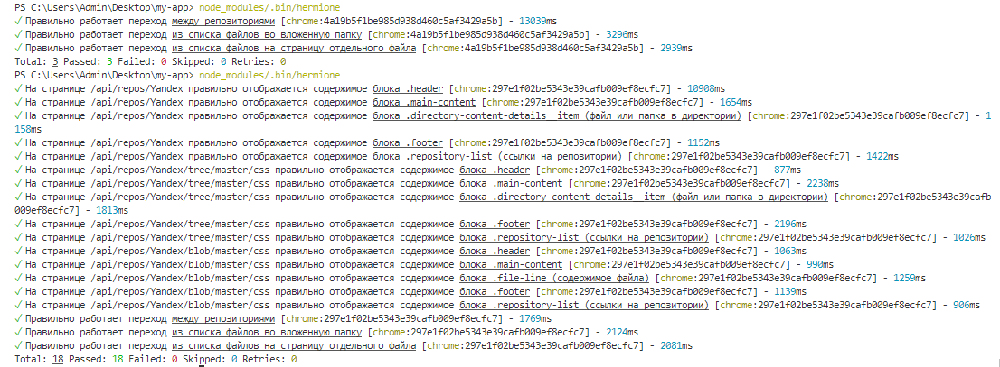
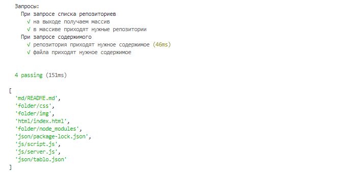

## Содержание
1. [Установка](https://github.com/d3f38/myArcanumWithReact/blob/master/README.md#установка)
2. [Запуск проекта](https://github.com/d3f38/myArcanumWithReact/blob/master/README.md#запуск)
3. [Тестирование](https://github.com/d3f38/myArcanumWithReact/blob/master/README.md#тестирование)

## Установка

1. Склонировать репозиторий `https://github.com/d3f38/myArcanumWithReact.git`
2. Перейти в репозиторий и установить зависимости, прописав команду `npm install`

## Запуск

Для просмотра проекта необходимо:

1. Открыть терминал и запустить сервер командой   

#### `node .\server\server.js 'место до папки с репозиториями'`

2. Открыть второй терминал и ввести команду

#### `npm start`

После откроется новая вкладка по адресу [http://localhost:3001](http://localhost:3001) (не исправил отображение на 3000 порту, возможно придется согласится с открытием нового порта)

### Реализовано

- использование create-react-app;
- навигация без перезагрузки страницы и сменой URL;
- при клике по директориям показывается содержимое этих директорий;
- при клике на файлы показывается содержимое этих файлов;
- при обновлении или прямом заходе по этому URL мы попадаем в тот же файл/директорию;
- разделение CSS по-компонентно.

### Осталось реализовать

- переходы по 'хлебным крошкам';
- оптимизация запросов на сервер, т.к. большие репозитории долго грузятся;

## Тестирование

### Интеграционное тестирование

Для запуска тестов необходимо, чтобы обязательно была установлена Гермиона. В зависимости от того, какая у вас установлена операционная система установка Гермионы будет отличаться. Из основного, вам необходимо установить пакет `npm install hermione`. И далее, при возникновении проблем искать решение в интернете, так как все сталкиваются с разными проблемами при установке.

#### Запуск

Запустить 4 команды в разных терминалах:

1. Для запуска сервера:
`node .\server\server.js 'место до папки с репозиториями'` - выбрав свою папку с репозиториями и прописав новые данные в файле test.hermione.js согласно тестируемому репозиторию:   
`const repositoryName = 'Yandex'`   
`const pathToDirectory = 'css'`      
`const pathToFile = 'css/normalize.css'`  

либо воспользоваться тестовой директорией с репозиторием и ничего больше не прописывать:) : 
`node .\server\server.js .\testData\Yandex`

2. Для запуска react:
 `npm start`
3. Для запуска selenium:
`selenium-standalone start`
4. Для запуска Hermione:
`node_modules/.bin/hermione`

После этого откроется новое окно браузера и начнут выполняться тесты.

### Пример результата выполнения тестов:

### Модульное тестирование

#### Запуск

Запустить команду `npm test`

#### Тестируемые блоки

1. Список репозиториев   
    √ Проверка на то, что при запросе списка репозиториев на выходе мы получаем массив   
    √ Проверка на то, что при запросе списка репозиториев в массиве приходят репозитории как в заглушке   
2. Содержимое репозиториев   
    √ Проверка на то, что при запросе приходит содержимое репозитория как в заглушке   
3. Содержимое файла   
    √ Проверка на то, что при запросе файла приходит содержимое файла в виде массива, как в заглушке   

### Пример результата выполнения тестов:

